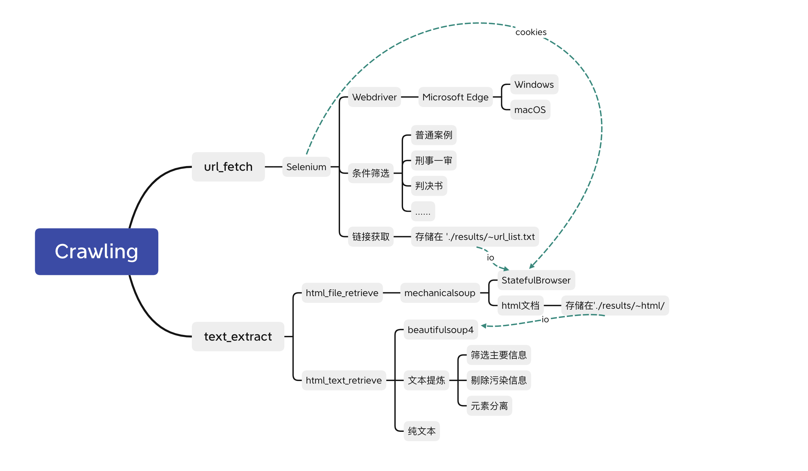
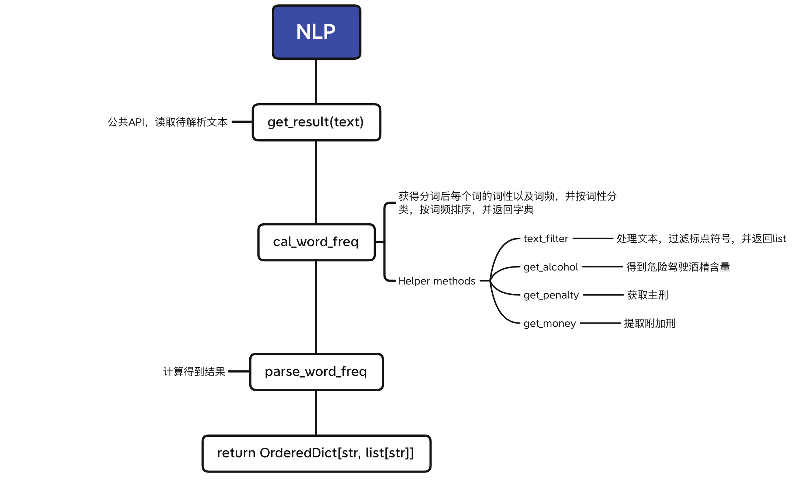
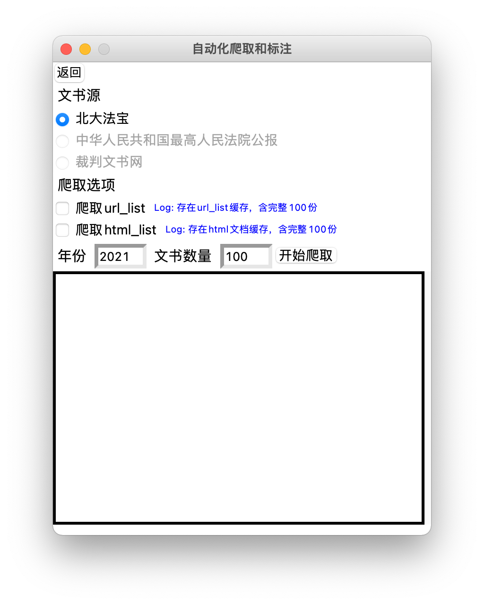
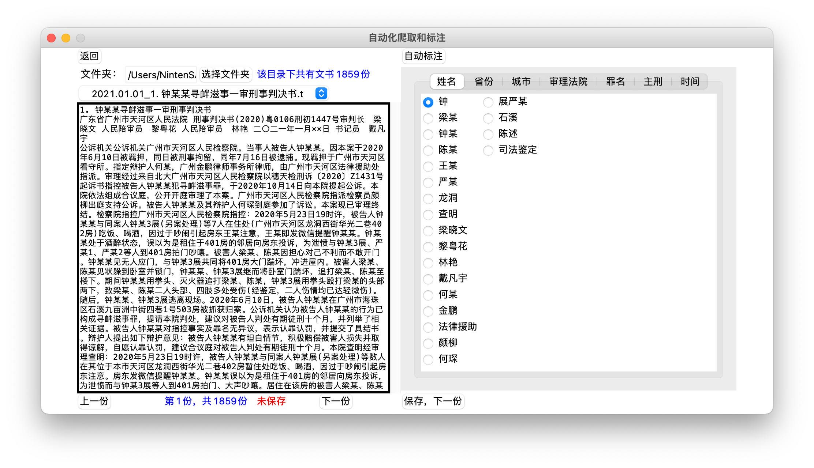

## 数据科学基础大作业-司法大数据自动化标注与分析

谭子悦 李佳骏 邱兴驰

### 1. 选题理解、思路

司法大数据，是个人民法庭在司法工作中形成的审判流程、执行信息、法律文书、庭审活动信息、司法政务、司法人事、外部协查等数据的总和及其关联关系。这些数据既包括审判执行活动中每天录入或产生的案件基本情况等结构化信息，也包括诸如起诉书、裁判文书等半结构化数据，还包括庭审活动录音录像、图像视频类证据等非结构化数据。而通过挖掘案件、人员、财物、外部信息等数据之间的关联关系，我们可以探索发现蕴藏其中的司法活动和社会发展规律。

司法大数据在中国法院最基础的应用在于通过大数据挖掘分析，利用类案推荐、文书自动纠错、文书自动生成、判决结果预测等功能建立智能辅助办案系统，而这其中所需要的数据主要来源于裁判文书。因此，本项目主要聚焦于司法大数据中的裁判文书，一种非结构化数据。

本项目的目标在于构建自动化裁判文书爬取与标注分析系统，其主要功能模块包括：

1. 爬虫模块：利用自动化web工具从文献源获取指定数量的裁判文书，并提取净化文本。案件以刑事为主。
2. 自动化标注模块：以爬虫模块获得的数据（或手动导入数据）作为数据源，分析并标注每一篇裁判文书中的属性标签（含通用属性和特别属性）
3. 分析统计模块：对标注结果进行数据可视化处理，呈现可能的统计结果

本系统通过Python编写，最终产品为本地GUI程序 (支持macOS与Windows)

#### 1.1 爬虫

爬虫部分的总体思路为：

> 1. 给定参数：搜索目标，限制条件，目标条数……
> 2. 利用自动化Web工具获取目标网页上的全部相关条目对应的URL，将URL条目存在URL_LIST中
> 3. 根据URL_LIST取回HTML文件缓存在本地文件夹
> 4. 利用HTML解析工具提取文本
> 5. 对文本进行净化与切分，输出纯文本

功能特性：

- 可以指定需要爬取的文书数量、年份、日期等参数
- 可以在客户端进行自动化爬取
- 可以分别设置：
  - 只爬取URL_LIST
  - （已有URL_LIST时）直接取回HTML并提取文本
  - （已有HTML缓存时）直接提取文本

#### 1.2 自动化标注

- **对上传的文本进行自动化分词，得到一系列案件基本信息，并按权重和出现比例按顺序排列，将最有可能的基本信息排在前面，在后续在前端界面勾选对应信息时自动勾选可能性最高的信息。**
- 处理任务
  - 对象：裁判文书
  - 任务：
    - **通用属性标注**：切割文本，自动化生成*犯罪基本信息*案件数据集
    - **特别属性标注**：基于本组计划对**危险驾驶**等刑事案件进行分析，会额外标注出与危险驾驶有关的系列条目。


- 实现思路：
  >1.文本过滤无效文本，如标点符号等噪音文本。
  >2.将文本按词性、词频划分，并分类初步生成词典
  >3.根据文本格式，直接提取案由，及判决结果
  >4.进行犯罪基本信息拆分，并生成json文件


#### 1.3 拓展

- 考虑到司法大数据具体应用场景更多的是将相似案件推给法官辅助判决、辅助各类法律工作、辅助法律材料管理、提高判决公平性、提高司法程序效率。所以本组在完成基本任务后，将根据自动化标注的信息作为筛选数据集，自动推荐相似裁判文书。
  - 实现想法
    - 根据自动化标注的信息，如：案由，涉及罪名，判决结果等，作为筛选数据集，并赋予不同权重。从数据库中搜索并推荐10篇相似裁判文书
    - 想法来源：
    ```
        裁判文书辅助生成系统是将起诉书、庭审笔录、证据等案件信息以及法律法规输入，通过对案件相关文书分析和信息智能提取，
    
        按照对应案由的文书模板自动生成裁判文书的初稿。法官不用再对照纸质卷宗摘录出相应的文书撰写所需事实信息、诉辩主张、
    
        法律适用等内容，大大提升了法官撰写裁判文书的效率。法官可以将节省的时间用来办理更多的案件，也可以有更多精力专注
    
        地投入到文书说理的撰写中。
                                           ————《司法大数据在中国法院的应用与前景展望》 孙晓勇
    ```


### 2. 实现

#### 2.1 爬虫



如图所示，爬虫部分可拆分为两个大模块：url_fetch和text_extract

实现流程为：

> **A. url_fetch**
>
> 1. 利用Selenium作为自动化爬取工具
> 2. Web Driver选用Microsoft Edge
>    - 可自动识别系统切换不同的Web Driver内核（仅支持macOS和Windows)
>    - 使用前需先安装Microsoft Edge
> 3. 打开网页
>    - 文书来源可选裁判文书网、北大法宝、中华人民共和国最高法院公报
>    - 出于运行稳定性考虑，优先选择北大法宝作为来源（需在南大内网使用）
> 4. 根据给定参数设置筛选条件
>    - 默认选择 普通案例、刑事一审、判决书
> 5. 获取`n`个条目链接，存储于 `./result/~url_list.txt`
>
> **B. text_extract**
>
> 1. 建立`mechanicalsoup.StatefulBrowser`对象browser
>
> 2. 将Selenium Web Driver的cookies转移给browser，防止因并发访问被网站屏蔽
>
> **a. html_file_retrieve**
>
> 3. 用browser获取`url_list.txt`中每一个条目对应的HTML文档
>
> **b. html_text_retrieve**
>
> 4. 利用Beautiful Soup提取每一个HTML文档中的文本
> 5. 提炼文本，得到最终的纯文本，储存为 `[序号].[文书名].txt`


#### 2.2 自动化标注

 
如图所示，NLP由四个功能模块构成
实现流程为：

> **A. posProcessing**
>
> 1. 根据裁判文书文本特性，自定义userdict.txt 
> 
> 2. 处理后的词典，存储于 `jiebaVersion/userdict.txt`
> 
>
> **B. getVerdict**
> 1. 通过文本路径，获得裁判文书。
> 
> 2. 根据裁判文书文本格式，获得判决结果。
>
> 3. 以list返回判决结果
>
> **C. textProcessing**
> 
> 1. 处理文本，过滤噪声
>
> 2. 使用jieba.posseg.cut,获得词频，词性
> 
> 3. 返回过滤后的文本
>
> **D.calWordFrequency**
> 
> 1. 按词频，词性分类排序
> 
> 2. 将结果储存于`jiebaVersion/wF.txt`
> 
> **E.getResult**
> 
> 1. 将文本分析结果写入`result.json`
> 
> 2. 并保存案件于`case.txt`


#### 2.3 拓展


#### 2.4 大致界面 

目前界面主要可分为三个部分：选择界面、爬虫界面、批注界面

后续还将增加数据可视化界面

##### a. 选择页面


选择页面包含其他功能模块的入口

##### b. 爬虫界面



爬虫界面可选择文献来源，设置爬取选项与爬取参数

下设文本框及时显示运行日志

##### c. 标注界面



标注界面可分为两个功能页面，左侧为文书原文显示，右侧为对应属性标签选项，自动化标注引擎会先行勾选最为可能的属性标签。

### 3. 当前进度展示

#### 3.1 爬虫

【放个视频，自己看吧您】

当前已实现内容：

1. 已完全实现自动化爬取功能（即一键爬取）
2. 可指定爬取数目与开始页（当前测试最高可稳定爬取1000份）
3. 可自动剔除噪音信息（如北大法宝嵌入在HTML中的反爬虫文字）
4. 可自动分段出审判结果与参考条文

有待实现的功能：

1. 限定年月日检索
2. 更多自定义参数（一审、二审等）

#### 3.2 自动化标注

当前已实现内容：

1. 已实现基本文书信息提取（姓名，性别，地区，罪名，法院等）

2. 可以在数据集中筛选**最优的标注信息**（将最有可能被标注的信息优先排列）

3. 已经可以将标注信息保存为 **标注.json**

有待实现的内容：

1. 提高分词准确度

2. 提高最优标注信息的准确性

3. 对多当事人案件的分析

4. hanlpVersion 自动化标注

#### 3.3 拓展

当前已实现内容：

1. 对危险驾驶的部分信息进行了提取

2. 其他可以用来进行相似文书推荐的信息，已经在**3.2 自动化标注**中提取

待实现：

1. 利用筛选数据集，自动推荐相似文书
