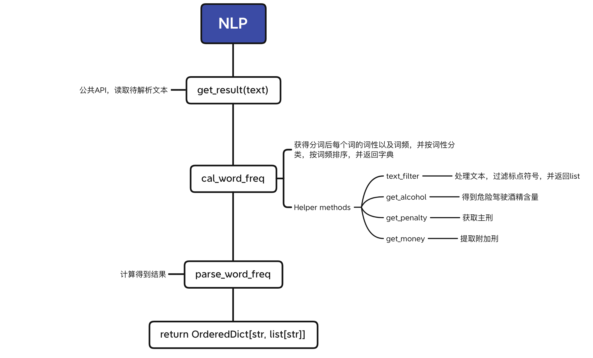

# 研究报告 (上) - 系统概述

**组长**： 谭子悦

**组员**：李佳骏、邱兴驰

**小组分工**：

- **爬虫**： 谭子悦
- **自动化标注**： 李佳骏、谭子悦
- **图形界面**：谭子悦、邱兴驰
- **数据处理与分析**：谭子悦、李佳骏
- **报告撰写**：谭子悦、李佳骏

## I. 系统概述

### 1. 选题理解、思路

司法大数据，是个人民法庭在司法工作中形成的审判流程、执行信息、法律文书、庭审活动信息、司法政务、司法人事、外部协查等数据的总和及其关联关系。这些数据既包括审判执行活动中每天录入或产生的案件基本情况等结构化信息，也包括诸如起诉书、裁判文书等半结构化数据，还包括庭审活动录音录像、图像视频类证据等非结构化数据。而通过挖掘案件、人员、财物、外部信息等数据之间的关联关系，我们可以探索发现蕴藏其中的司法活动和社会发展规律。

司法大数据在中国法院最基础的应用在于通过大数据挖掘分析，利用类案推荐、文书自动纠错、文书自动生成、判决结果预测等功能建立智能辅助办案系统，而这其中所需要的数据主要来源于裁判文书。因此，本项目主要聚焦于司法大数据中的裁判文书，一种非结构化数据。

本项目的目标在于构建自动化裁判文书爬取与标注分析系统，该系统由Python编写，为桌面客户端程序。

------

主要功能模块包括：

#### 1.1 爬虫

利用自动化web工具从文献源获取指定数量的裁判文书，并提取净化文本。案件以刑事为主。

爬虫部分的总体思路为：

> 1. 给定参数：搜索目标、限制条件、目标条数……
> 2. 利用自动化Web工具获取目标网页上的全部相关条目对应的URL，将URL条目存在URL_LIST中
> 3. 根据URL_LIST取回HTML文件缓存在本地文件夹
> 4. 利用HTML解析工具提取文本
> 5. 对文本进行净化与切分，输出纯文本

功能特性：

- 可以指定需要爬取的文书数量、年份等参数
- 可以在客户端进行自动化爬取
- 可以选择进行不同的爬取步骤

#### 1.2 自动化标注

利用爬虫模块获得的数据（或手动导入数据）作为数据源，分析并标注每一篇裁判文书中的属性标签

自动化标注部分的总体思路为：

> 1. 输入从爬虫模块获取的文本
> 2. 根据先行制定的用户词典，对文本进行分词处理与词性分类
> 3. 将结果分类放入各属性Tag的候选列表中，列表里按可能性从高到低排序
> 4. 输出以属性名称与对应候选列表为键值对的字典

功能特性：

- 可以识别出以下属性：姓名、省份、城市、审理法院、罪名、主刑、附加刑、酒精含量、时间
  - 省份与城市为审理所在地
  - 酒精含量仅在危险驾驶罪中可获取
  - 主刑包含：管制、拘役、有期徒刑、无期徒刑、死刑
  - 附加刑包含：没收、罚金

---

#### 1.4 数据分析

此外，在获取到标注数据后，我们围绕“危险驾驶”相关内容进行了数据分析。

### 2. 实现

#### 2.1 爬虫

如图所示，爬虫部分可拆分为两个大模块：url_fetch和text_extract

实现流程为：

> **A. url_fetch**
>
> 1. 利用Selenium作为自动化爬取工具
> 2. Web Driver选用Microsoft Edge
>    - 可自动识别系统切换不同的Web Driver内核（仅支持macOS和Windows)
>    - 使用前需先安装Microsoft Edge
> 3. 打开网页
>    - 文书来源可选裁判文书网、北大法宝、中华人民共和国最高法院公报
>    - 出于运行稳定性考虑，选择北大法宝作为来源（需在南大内网使用）
> 4. 根据给定参数设置筛选条件
>    - 默认选择 普通案例、刑事事件、判决书
> 5. 获取`n`个条目链接，存储于 `./result/~url_list.txt`
>
> **B. text_extract**
>
> 1. 建立`mechanicalsoup.StatefulBrowser`对象browser
>
> 2. 将Selenium Web Driver的cookies转移给browser，防止因并发访问被网站屏蔽
>
> **a. html_file_retrieve**
>
> 3. 用browser获取`url_list.txt`中每一个条目对应的HTML文档
>
> **b. html_text_retrieve**
>
> 4. 利用Beautiful Soup提取每一个HTML文档中的文本
> 5. 提炼文本，得到最终的纯文本，储存为 `[序号].[文书名].txt`

#### 2.2 自动化标注

 

如图所示，自动化标注（NLP）部分主要由一个公共API，两个处理步骤组成

以下是一些实现细节：

> **A. cal_word_freq**
>
> 对从公共API获得的文本进行预处理
>
> 1. 该部分使用先行定义的用户辞典，采用Jieba进行分词处理与词性分类
>    - 用户辞典包括：全国法院信息、罪名表、全国省级与市级行政区名单、其他自定义信息
> 2. 除此之外，利用正则表达式单独对酒精含量、主刑、附加刑进行识别与获取
>    - 此三类属性只提供单一候选项，若无匹配结果则返回空字符串，留给下游处理
>
> **B. parse_word_freq**
>
> 对上一部分获得的词频字典进行分类处理，输入参数中含原文本，供补漏操作
>
> 1. 将酒精、主刑、附加刑三类归档，只取唯一可能
> 2. 将法院信息归档，从法院信息中提取地区信息，填入省份、城市的候选列表
> 3. 将姓名、省份、城市、罪名等多可能项归档
> 4. 处理边缘情况
>    1. 若为省份直辖市，则城市名同省份
>    2. 若未找到省份信息，但已有城市信息，则用预处理的逆向匹配表获取省份信息
>    3. 若未获得审理法院信息但有城市与省份信息，则将法院归于该市的中级人民法院
>    4. 利用正则表达式从原文本中单独获取罪名信息，装入罪名候选列表，再重新计算词频并排序
>       - 此步骤目的在于防止遗失罪名，或错误匹配罪名

### 3. 成果

#### 3.1 爬虫

爬虫界面可选择文献来源，设置爬取选项与爬取参数，下设文本框，可显示运行日志。

- 可以一次性自动化爬取2000份文书
  - 每200份需要手动输入一次验证码
  - 由于网站限制，多于2000份的部分无法显示
- 每一步骤都会及时保存爬取结果，因此意外退出程序不会导致已有数据全部丢失

#### 3.2 自动化标注

标注界面可分为两个功能页面，左侧为文书原文显示，右侧为对应属性标签选项，自动化标注引擎会先行勾选可能性最大的属性标签。

- 可以精准识别姓名、省份、城市、审理法院、罪名、主刑、附加刑、酒精含量、时间等信息
  - 正常情况下每份都应有姓名、省份、城市、审理法院、罪名、时间信息
  - 根据不同案件可识别出相应的主刑、附加刑，若为危险驾驶事件还可提取出酒精含量
  - 对于涉案人数不止一人，或罪名不止一项的案件无法准确识别
- 出于运行效率考虑，左侧文字窗口只截取前2000字
- 可以选择“保存，下一份”或“下一份”（不保存）
- 选择“自动标注”后可自动处理全部文件，该过程不会调用gui渲染，因此速度快于普通处理

