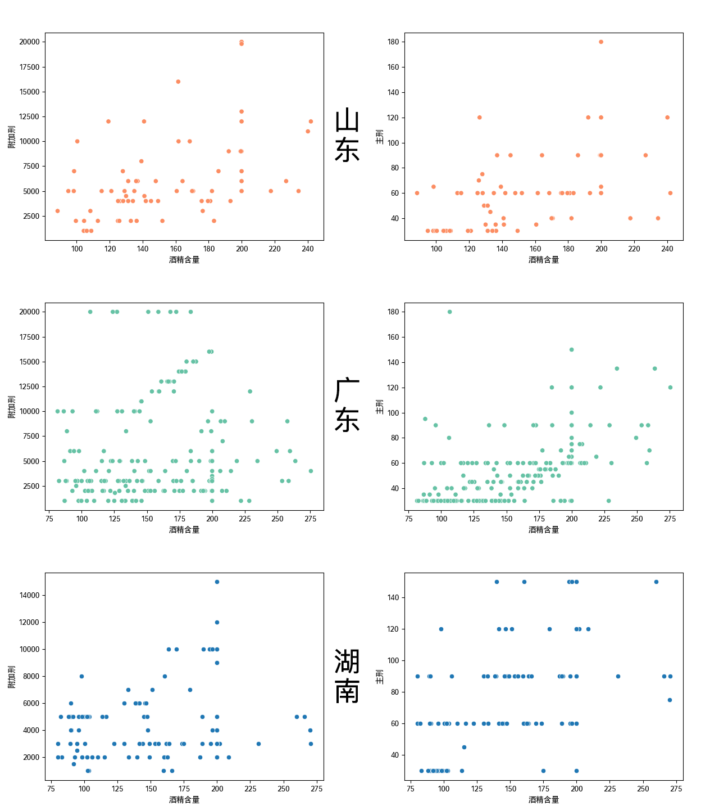

# 研究报告 (下) - 数据分析报告

## II. 数据分析报告：用大数据浅析危险驾驶罪量刑标准问题

### 一、研究背景

&emsp;&emsp;2011年5月1日，《中华人民共和国刑法修正案（八）》正式施行，其中规定了醉酒后在道路上驾驶机动车构成危险驾驶罪。

&emsp;&emsp;根据最高人民法院公布的有关数据，自2011年“醉驾入刑”以来，全国法院审结的危险驾驶罪案件数量已经由2013年的9万多件、居当年刑事犯罪案件数量的第三位、占当年法院审结的全部刑事案件总数的9.5%，发展为2015年的近14万件、居当年刑事犯罪的第二位、占全部刑事案件总数的12.61%，进而到2019年的31.9万件、超过盗窃罪，居刑事犯罪之首、占全部刑事案件的24.6%。到2020年，全国法院审结“醉驾”等危险驾驶犯罪案件总数为28.9万件，占刑事案件总数的比例高达25.9%，危险驾驶罪成为名副其实的第一大罪，比盗窃罪高出1.71倍。

&emsp;&emsp;而在上述危险驾驶案件中，发案率最高的危险驾驶犯罪类型正是“醉驾”。

&emsp;&emsp;此外，对于行为人来说，醉酒驾驶的法律后果非常严重：

> 1. “醉驾”经历将**纳入个人信用记录**，贷款、消费等受到限制；
> 2. 发生重大交通事故的，行为人不仅不能得到保险公司的理赔，还要被**吊销驾驶证，不得重新取得驾驶证**。
> 3. 最为严重的后果是，行为人在承担刑事责任的同时，还需要对一系列附随后果负责，我国监察官法、法官法、检察官法、公务员法、律师法、教师法、公证员法、医师法等数十部法律明确规定受过刑事处罚的人**不能从事某些相关职业或担任特定职务**，因此，因危险驾驶罪被判刑的人，会被用人单位解除劳动合同，公职人员将被开除党籍、开除公职等，特定从业者如律师、医师等的执业资格被吊销。
> 4. 《刑法》第100条第1款明确规定，“依法受过刑事处罚的人，在入伍、就业的时候，应当如实向有关单位报告自己曾受过刑事处罚，不得隐瞒”。“醉驾”者由此**不能报考国家公务员，入伍或报考军校无法通过政治审查**。

&emsp;&emsp;可以说，“醉驾”犯罪能够让行为人在极短时间内失业、坐牢、倾家荡产。 受过刑事处罚的人不仅本人的一生受到影响，有关附随后果还不可避免地会“株连”子女。**因此，每年将30万余人打上“罪犯”的烙印，长此以往，无论对国家、社会还是危险驾驶者个人来说，都是极大的损失**。

### 二、研究目的

&emsp;&emsp;为了解决上述问题，目前有关司法机关在实践中采取的“纠偏”思路之一为在司法上限定危险驾驶罪的适用范围。因此，我们将利用从“自动化裁判文书爬取与标注分析系统”中获得的数据，通过统计学方法分析其反应的危险驾驶罪量刑标准，并与当前有关司法机关对该标准的指导意见与要求进行比较，目的在于检验我们的数据是否可以体现真实情况，以此论证此系统的准确性与可靠性。

### 三、研究内容

#### （一）数据概览

| 年份 | 文书总数 | 危险驾驶总数 | 危险驾驶占比 | 醉驾总数 | 醉驾占危险驾驶占比 |
| ---- | -------- | ------------ | ------------ | -------- | ------------------ |
| 2020 | 1820     | 292          | 16.04%       | 274      | 93.84%             |
| 2021 | 3825     | 1512         | 39.53%       | 1378     | 91.14%             |

▲（表1） *2020、2021年刑事文书分布情况*

&emsp;&emsp;上表为目前已有刑事文书数据，其中20年的危险驾驶占比16.04%略低于最高人民法院公布的20年统计数据中的25.9%，其中21年的数据则略高于此。根据大数定律，由于2021年的样本量较多，接下来将针对该年的3825份刑事文书进行分析。

| 排名 | 罪名                   | 数量 | 占比   |
| ---- | ---------------------- | ---- | ------ |
| 1    | 危险驾驶罪             | 1512 | 39.53% |
| 2    | 盗窃罪                 | 641  | 16.76% |
| 3    | 帮助信息网络犯罪活动罪 | 242  | 6.33%  |
| 4    | 交通肇事罪             | 186  | 4.86%  |
| 5    | 故意伤害罪             | 175  | 4.58%  |

▲（表2） *2021年罪名前五*

&emsp;&emsp;危险驾驶罪位居2021年罪名占比第一，约为第二名盗窃罪的2.4倍

| 省级行政区 | 文书总数 | 危险驾驶总数 | 危险驾驶占比 | 醉驾总数 | 醉驾占危险驾驶占比 |
| ---------- | -------- | ------------ | ------------ | -------- | ------------------ |
| 广东       | 509      | 246          | 48.33%       | 202      | 82.11%             |
| 辽宁       | 327      | 144          | 44.04%       | 138      | 95.83%             |
| 湖南       | 312      | 119          | 38.14%       | 117      | 98.32%             |
| 浙江       | 255      | 57           | 22.35%       | 57       | 100.00%            |
| 广西       | 200      | 44           | 22.00%       | 43       | 97.73%             |
| 江苏       | 191      | 65           | 34.03%       | 64       | 98.46%             |
| 北京       | 167      | 37           | 22.16%       | 32       | 86.49%             |
| 云南       | 167      | 87           | 52.10%       | 83       | 95.40%             |
| 四川       | 166      | 61           | 36.75%       | 59       | 96.72%             |
| 山东       | 162      | 89           | 54.94%       | 81       | 91.01%             |

▲（表3）*2021年文书总数前十省份*

| 省级行政区 | 文书总数 | 危险驾驶总数 | 危险驾驶占比 | 醉驾总数 | 醉驾占危险驾驶占比 |
| ---------- | -------- | ------------ | ------------ | -------- | ------------------ |
| 山东       | 162      | 89           | 54.94%       | 81       | 91.01%             |
| 云南       | 167      | 87           | 52.10%       | 83       | 95.40%             |
| 吉林       | 101      | 50           | 49.50%       | 40       | 80.00%             |
| 广东       | 509      | 246          | 48.33%       | 202      | 82.11%             |
| 辽宁       | 327      | 144          | 44.04%       | 138      | 95.83%             |
| 甘肃       | 110      | 46           | 41.82%       | 39       | 84.78%             |
| 陕西       | 147      | 59           | 40.14%       | 48       | 81.36%             |
| 河南       | 134      | 53           | 39.55%       | 47       | 88.68%             |
| 湖南       | 312      | 119          | 38.14%       | 117      | 98.32%             |
| 四川       | 166      | 61           | 36.75%       | 59       | 96.72%             |

▲（表4）*2021年危险驾驶前十省份（已过滤文书总数低于100的省份）*

#### （二）数据分析

&emsp;&emsp;我们首先假设：危险驾驶罪的量刑标准与犯案人血液酒精含量存在线性关系。

&emsp;&emsp;经查阅相关资料，我们得到关于危险驾驶罪量刑的以下规定：

> 根据《刑法》第一百三十三条之一规定：“在道路上驾驶机动车，有下列情形之一的，处拘役，并处罚金”

&emsp;&emsp;其中：

> - 拘役的期限，为一个月以上六个月以下
> - 危险驾驶罪为无限额罚金罪，一千元起罚
> - 醉酒的起罚标准为血液酒精含量80mg/100ml及以上

&emsp;&emsp;因此，我们将通过主刑、附加刑这两项可以量化的因素来衡量危险驾驶罪的量刑标准。根据上述信息对数据进行筛选后，我们得到了以下两张散点图：

▲（图1）*全国范围内酒精含量与附加刑、主刑关系的散点图*

&emsp;&emsp;其中，酒精含量限制在80mg/ml以上，300mg/ml及以下（筛除极端情况）；附加刑为罚金金额（单位：元），限制在1000元以上，22000元以下（筛除极端情况）；主刑为拘役时间（单位：天），限制在30天以上，180天以下。不同颜色分别代表不同的省份。

&emsp;&emsp;由上图可见，在全国范围内量刑标准与酒精含量显然并不存在任何函数关系，但是这一结果是符合事实的：危险驾驶罪在各个省份的量刑标准并不相同。所以接下来将选取个别省份单独检验。

&emsp;&emsp;根据表3、4的结果，我们综合数据可靠性、情况代表性选取了山东、广东、湖南三省进行后续检验。

▲（图2）*山东、广东、湖南三省酒精含量与附加刑、主刑关系的散点图*

&emsp;&emsp;观察散点图可见，直观上三省数据并不存在线性关系。下面分别计算三省的皮尔逊指数与p值：

| 省份   | rho1   | p-value1 | rho2   | p-value2 |
| ------ | ------ | -------- | ------ | -------- |
| 山东省 | 0.4478 | 1.0000   | 0.5241 | 1.0000   |
| 广东省 | 0.0933 | 0.8992   | 0.5299 | 1.0000   |
| 湖南省 | 0.1644 | 0.9611   | 0.5004 | 1.0000   |

▲（表5）*三省的皮尔逊指数与p值。*
*其中rho1、rho2分别对应酒精含量与附加刑、主刑的皮尔逊指数，p-value1、p-value2为两者相应p值。*

**计算原理**：

1. 假定样本满足皮尔逊相关系数显著性检验的条件
   - 实验数据成对，假定满足正态分布总体
   - 离群点已被移除，实验数据间差距不大
   - 每组样本为独立抽样
   - 计算皮尔逊系数 }{\sqrt{D(X)D(Y)}})
2. 构造检验统计量 
3. 计算 )

#### （三）结果检验

### 四、结论

### 五、参考文献

[1]孙晓勇. 司法大数据在中国法院的应用与前景展望[J]. 中国法学, 2021, 4. DOI:[10.14111](https://doi.org/10.14111).

[[2]周光权. 论刑事一体化视角的危险驾驶罪[J]. 政治与法律, 2022, 1.](https://mp.weixin.qq.com/s/552-gfolqT4dr6wlb97oOA)
