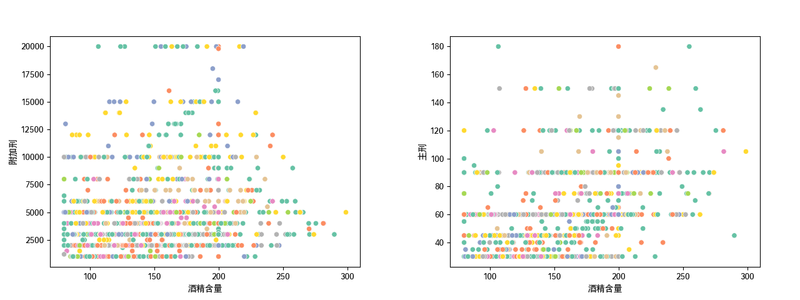
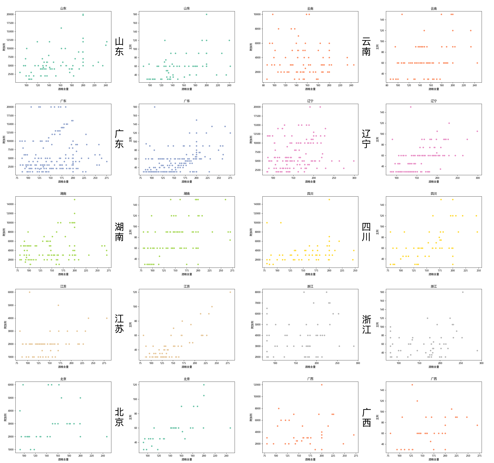

# 研究报告 (下) - 数据分析报告

## II. 数据分析报告：用大数据浅析危险驾驶罪量刑标准问题

作者：谭子悦

### 一、研究背景

&emsp;&emsp;2011年5月1日，《中华人民共和国刑法修正案（八）》正式施行，其中规定了醉酒后在道路上驾驶机动车构成危险驾驶罪。

&emsp;&emsp;根据最高人民法院公布的有关数据，自2011年“醉驾入刑”以来，全国法院审结的危险驾驶罪案件数量已经由2013年的9万多件、居当年刑事犯罪案件数量的第三位、占当年法院审结的全部刑事案件总数的9.5%，发展为2015年的近14万件、居当年刑事犯罪的第二位、占全部刑事案件总数的12.61%，进而到2019年的31.9万件、超过盗窃罪，居刑事犯罪之首、占全部刑事案件的24.6%。到2020年，全国法院审结“醉驾”等危险驾驶犯罪案件总数为28.9万件，占刑事案件总数的比例高达25.9%，危险驾驶罪成为名副其实的第一大罪，比盗窃罪高出1.71倍。

&emsp;&emsp;而在上述危险驾驶案件中，发案率最高的危险驾驶犯罪类型正是“醉驾”。

&emsp;&emsp;此外，对于行为人来说，醉酒驾驶的法律后果非常严重：

> 1. “醉驾”经历将**纳入个人信用记录**，贷款、消费等受到限制；
> 2. 发生重大交通事故的，行为人不仅不能得到保险公司的理赔，还要被**吊销驾驶证，不得重新取得驾驶证**。
> 3. 最为严重的后果是，行为人在承担刑事责任的同时，还需要对一系列附随后果负责，我国监察官法、法官法、检察官法、公务员法、律师法、教师法、公证员法、医师法等数十部法律明确规定受过刑事处罚的人**不能从事某些相关职业或担任特定职务**，因此，因危险驾驶罪被判刑的人，会被用人单位解除劳动合同，公职人员将被开除党籍、开除公职等，特定从业者如律师、医师等的执业资格被吊销。
> 4. 《刑法》第100条第1款明确规定，“依法受过刑事处罚的人，在入伍、就业的时候，应当如实向有关单位报告自己曾受过刑事处罚，不得隐瞒”。“醉驾”者由此**不能报考国家公务员，入伍或报考军校无法通过政治审查**。

&emsp;&emsp;可以说，“醉驾”犯罪能够让行为人在极短时间内失业、坐牢、倾家荡产。 受过刑事处罚的人不仅本人的一生受到影响，有关附随后果还不可避免地会“株连”子女。**因此，每年将30万余人打上“罪犯”的烙印，长此以往，无论对国家、社会还是危险驾驶者个人来说，都是极大的损失**。

### 二、研究目的

&emsp;&emsp;为了解决上述问题，目前有关司法机关在实践中采取的“纠偏”思路之一是在司法上限定危险驾驶罪的适用范围。因此，我们将利用从“自动化裁判文书爬取与标注分析系统”中获得的数据，通过统计学方法分析其反应的危险驾驶罪量刑标准，并与当前有关司法机关对该标准的指导意见与要求进行比较。

&emsp;**&emsp;此研究的目的在于检验我们的数据是否可以反应社会真实情况，并以此论证此“自动化裁判文书爬取与标注分析系统”的可用性与准确性**。

### 三、研究内容

#### （一）数据概览

| 年份 | 文书总数 | 危险驾驶总数 | 危险驾驶占比 | 醉驾总数 | 醉驾占危险驾驶占比 |
| ---- | -------- | ------------ | ------------ | -------- | ------------------ |
| 2020 | 1820     | 292          | 16.04%       | 274      | 93.84%             |
| 2021 | 3825     | 1512         | 39.53%       | 1378     | 91.14%             |

▲（表1） *2020、2021年刑事文书分布情况*

&emsp;&emsp;上表为目前已有刑事文书数据，其中20年的危险驾驶占比16.04%略低于最高人民法院公布的20年统计数据中的25.9%，21年的数据则略高于此。根据大数定律，由于2021年的样本量较多，接下来将基于该年的3825份刑事文书进行分析。

| 排名 | 罪名                   | 数量 | 占比   |
| ---- | ---------------------- | ---- | ------ |
| 1    | 危险驾驶罪             | 1512 | 39.53% |
| 2    | 盗窃罪                 | 641  | 16.76% |
| 3    | 帮助信息网络犯罪活动罪 | 242  | 6.33%  |
| 4    | 交通肇事罪             | 186  | 4.86%  |
| 5    | 故意伤害罪             | 175  | 4.58%  |

▲（表2） *2021年罪名前五*

&emsp;&emsp;危险驾驶罪位居2021年罪名占比第一，约为第二名盗窃罪的2.4倍。

| 省级行政区 | 文书总数 | 危险驾驶总数 | 危险驾驶占比 | 醉驾总数 | 醉驾占危险驾驶占比 |
| ---------- | -------- | ------------ | ------------ | -------- | ------------------ |
| 广东       | 509      | 246          | 48.33%       | 202      | 82.11%             |
| 辽宁       | 327      | 144          | 44.04%       | 138      | 95.83%             |
| 湖南       | 312      | 119          | 38.14%       | 117      | 98.32%             |
| 浙江       | 255      | 57           | 22.35%       | 57       | 100.00%            |
| 广西       | 200      | 44           | 22.00%       | 43       | 97.73%             |
| 江苏       | 191      | 65           | 34.03%       | 64       | 98.46%             |
| 北京       | 167      | 37           | 22.16%       | 32       | 86.49%             |
| 云南       | 167      | 87           | 52.10%       | 83       | 95.40%             |
| 四川       | 166      | 61           | 36.75%       | 59       | 96.72%             |
| 山东       | 162      | 89           | 54.94%       | 81       | 91.01%             |

▲（表3）*2021年文书总数前十省份*

| 省级行政区 | 文书总数 | 危险驾驶总数 | 危险驾驶占比 | 醉驾总数 | 醉驾占危险驾驶占比 |
| ---------- | -------- | ------------ | ------------ | -------- | ------------------ |
| 山东       | 162      | 89           | 54.94%       | 81       | 91.01%             |
| 云南       | 167      | 87           | 52.10%       | 83       | 95.40%             |
| 广东       | 509      | 246          | 48.33%       | 202      | 82.11%             |
| 辽宁       | 327      | 144          | 44.04%       | 138      | 95.83%             |
| 湖南       | 312      | 119          | 38.14%       | 117      | 98.32%             |
| 四川       | 166      | 61           | 36.75%       | 59       | 96.72%             |
| 江苏       | 191      | 65           | 34.03%       | 64       | 98.46%             |
| 浙江       | 255      | 57           | 22.35%       | 57       | 100.00%            |
| 北京       | 167      | 37           | 22.16%       | 32       | 86.49%             |
| 广西       | 200      | 44           | 22.00%       | 43       | 97.73%             |

▲（表4）*2021年文书总数前十省份，按危险驾驶占比降序排列*

&emsp;&emsp;由表可见，各省份的危险驾驶罪均以“醉驾”为主，因此**以下“危险驾驶罪”将主要指“醉驾”**。由于上述十省文书总数较多，且在地理分布上我国六大地理分区中除西北地区（西北地区样本量过少）均有涉及，较具代表性，故**以下将针对上述十省的数据进行分析**。

#### （二）数据分析

&emsp;&emsp;经查阅相关资料，我们得到关于危险驾驶罪量刑的以下规定：

> 根据《刑法》第一百三十三条之一规定：“在道路上驾驶机动车，有下列情形之一的，处拘役，并处罚金”

&emsp;&emsp;其中：

> - 拘役的期限，为一个月以上六个月以下
> - 危险驾驶罪为无限额罚金罪，一千元起罚
> - 醉酒的起罚标准为血液酒精含量80mg/100ml及以上

&emsp;&emsp;因此，我们将**通过主刑、附加刑这两项可以量化的因素来衡量危险驾驶罪的量刑标准**。根据上述信息对数据进行筛选后，我们得到了以下两张散点图：

▲（图1）*全国范围内酒精含量与附加刑、主刑关系的散点图*

&emsp;&emsp;其中，酒精含量限制在80mg/ml以上，300mg/ml及以下（筛除极端情况）；附加刑为罚金金额（单位：元），限制在1000元以上，22000元以下（筛除极端情况）；主刑为拘役时间（单位：天），限制在30天以上，180天以下。不同颜色分别代表不同的省份。

##### 1. 酒精样本总体

&emsp;&emsp;首先检验文书总数前十省份中各省份血液酒精含量样本是否符合正态分布总体。

&emsp;&emsp;提出原假设 ：各省份血液酒精含量样本符合正态分布总体，取alpha=0.001

| 省份 | 偏度峰度检验统计量 | p-value |
| ---- | ------------------ | ------- |
| 山东 | 8.4383             | 0.0147  |
| 云南 | 0.8666             | 0.6484  |
| 广东 | 6.3847             | 0.0411  |
| 辽宁 | 9.3448             | 0.0093  |
| 湖南 | 10.6761            | 0.0048  |
| 四川 | 3.6937             | 0.1577  |
| 江苏 | 9.6938             | 0.0079  |
| 浙江 | 3.9637             | 0.1378  |
| 北京 | 2.0578             | 0.3574  |
| 广西 | 1.0599             | 0.5886  |

▲（表5）*文书总数前十省份的血液酒精含量样本偏度峰度检验量与p值（按表4排序）。*

&emsp;&emsp;由结果可见，各省血液酒精含量样本均不拒绝原假设，故可认为**各省血液酒精含量样本符合正态分布总体**。

&emsp;&emsp;下面计算各省份血液酒精含量样本的分布特征：

| 省份 | 平均值 | 标准差 | 最小值 | 最大值 |
| ---- | ------ | ------ | ------ | ------ |
| 北京 | 144.70 | 38.99  | 92.40  | 247.10 |
| 山东 | 156.15 | 39.70  | 88.50  | 242.00 |
| 云南 | 153.94 | 36.24  | 86.16  | 245.10 |
| 辽宁 | 153.72 | 42.34  | 84.80  | 299.00 |
| 江苏 | 144.73 | 43.17  | 82.00  | 281.40 |
| 广东 | 158.43 | 43.51  | 81.57  | 275.64 |
| 湖南 | 156.64 | 48.01  | 80.00  | 270.70 |
| 四川 | 156.70 | 43.87  | 80.00  | 247.50 |
| 浙江 | 165.46 | 54.70  | 80.00  | 290.00 |
| 广西 | 156.26 | 48.82  | 80.00  | 270.40 |

▲（表6）*文书总数前十省份的血液酒精含量样本的分布特征（按最小值降序排列）。单位：mg/ml*

&emsp;&emsp; 由上表可见，在统计意义上**各省醉驾的入罪门槛并不相同**。值得注意的是，此处北京市最小值以92.40mg/ml位列第一，平均值以144.70mg/ml位列倒数第一，根据表4，北京市的危险驾驶罪占比位居倒数第二。这反映了各省份对入罪门槛的调整可能与降低犯罪率有关。

##### 2. 线性关系

&emsp;&emsp;由图1可见，在全国范围内量刑标准与酒精含量并不存在显然线性关系，这一结果是符合事实的：危险驾驶罪在各个省份的量刑标准并不完全相同。所以接下来将单独看每个省份的分布情况：

▲（图2）*文书总数前十省份酒精含量与附加刑、主刑关系的散点图*

&emsp;&emsp;观察散点图未找到明显线性关系。故提出假设：，并取 alpha=0.001，进行假设检验。（其中为主刑、附加刑与酒精含量的皮尔逊相关系数，下简写为r)

----

**计算过程**：

1. 假定样本满足皮尔逊相关系数显著性检验的条件

   - 实验数据成对，满足正态分布总体

   - 离群点已被移除，实验数据间差距不大

   - 每组样本为独立抽样

2. 计算皮尔逊系数 }{\sqrt{D(X)D(Y)}})

2. 构造检验统计量 

3. 计算 （双边检验）

----

得到结果：

| 省份 | r1      | p-value1   | r2     | p-value2   |
| ---- | ------- | ---------- | ------ | ---------- |
| 江苏 | 0.3232  | 0.0098     | 0.7799 | **0.0000** |
| 北京 | 0.2039  | 0.2711     | 0.6996 | **0.0000** |
| 辽宁 | 0.1586  | 0.0642     | 0.6072 | **0.0000** |
| 四川 | 0.2261  | 0.0908     | 0.5475 | **0.0000** |
| 广东 | 0.0933  | 0.2015     | 0.5299 | **0.0000** |
| 山东 | 0.4478  | **0.0001** | 0.5241 | **0.0000** |
| 湖南 | 0.1644  | 0.0778     | 0.5004 | **0.0000** |
| 云南 | -0.1311 | 0.2434     | 0.4044 | **0.0002** |
| 广西 | 0.1193  | 0.4519     | 0.3376 | 0.0288     |
| 浙江 | 0.1273  | 0.3454     | 0.2427 | 0.0689     |

▲（表7）*文书总数前十省份的皮尔逊系数与p值（按r2排序）。*
*其中r1、r2分别对应酒精含量与附加刑、主刑的皮尔逊系数，p-value1、p-value2为两者相应p值。*

&emsp;&emsp; 表格中加粗数据为可拒绝原假设的p值。由结果可知，对于附加刑，十省中仅一省具有显著线性关系；对于主刑，十省中有八省都具有显著线性关系。综上所述，可以得出结论：**在十省对危险驾驶罪的量刑标准中，主刑与酒精含量在统计意义上基本均存在显著线性关系，而附加刑与酒精含量在统计意义上则基本不存在显著线性关系**。

&emsp;&emsp;基于主刑与附加刑的主次关系，这一结论可以推广至：**各省对危险驾驶罪的量刑标准与酒精含量在统计意义上基本均存在显著线性关系**。但需要注意的是，由于计算出的皮尔逊系数均离1有一定差值，故此处的**线性关系并不严格**。

#### （三）结果检验

&emsp;&emsp; 综合上述分析结果，在统计学意义上我们可以得出以下推断：**各省危险驾驶罪的量刑标准与被告人的醉酒程度存在强关联性，但除此还受其他具体案件情况的影响，如实际损害情况、被告人认罪态度、行驶速度等。此外，部分省份还不同程度地上调了“醉驾”的入罪门槛，以此降低危险驾驶罪的犯罪率**。

&emsp;&emsp;我们查阅有关资料发现，

- 《最高人民法院关于常见犯罪的量刑指导意见（二）（试行）》（2017）中提到：

> &emsp;&emsp;对于醉酒驾驶机动车的被告人，应当**综合考虑被告人的醉酒程度、机动车类型、车辆行驶道路、行车速度、是否造成实际损害以及认罪悔罪等情况**，准确定罪量刑。对于情节显著轻微危害不大的，不予定罪处罚；犯罪**情节轻微不需要判处刑罚的，可以免予刑事处罚**。

- 全国也有省级法院、检察院和公安机关联合或单独发文，要求：

> 在办理危险驾驶案件时，**不应只考虑血液中酒精含量这一个标准**，还应当综合把握行为人的醉酒程度、醉酒后驾驶机动车的原因、目的……等其他影响定罪量刑等情节，切实贯彻**宽严相济刑事政策**，作出区别化的正确处理。

- 浙江省、湖北省、天津市等省份将“醉驾”入罪标准从80mg/ml提高至100mg/ml

&emsp;&emsp;因此，我们的数据分析结果基本正确反映了当前我国危险驾驶罪量刑标准的总体情况。

### 四、结论

&emsp;&emsp;在上述分析中，还存在以下可能影响准确性的因素没有考虑：

1. 由于北大法宝的限制，2021年的3825份文书剧本局限在年初与年末的四个月中，时间因素可能会对呈现结果有一定影响。
2. 现有的文书数据量只有不到全年总刑事事件数量的1%，并未达到“大数据”的水平。
3. 自动化标注系统仍然存在少量错误标注的情况

&emsp;&emsp;基于分析结果与上述情况，我们得出了以下结论：**我们的“自动化裁判文书爬取与标注分析系统”已具有一定程度的可用性，但在准确性上还需要继续优化改进。**

### 五、参考文献

[1]孙晓勇. 司法大数据在中国法院的应用与前景展望[J]. 中国法学, 2021, 4. DOI:[10.14111](https://doi.org/10.14111).

[[2]周光权. 论刑事一体化视角的危险驾驶罪[J]. 政治与法律, 2022, 1.](https://mp.weixin.qq.com/s/552-gfolqT4dr6wlb97oOA)
